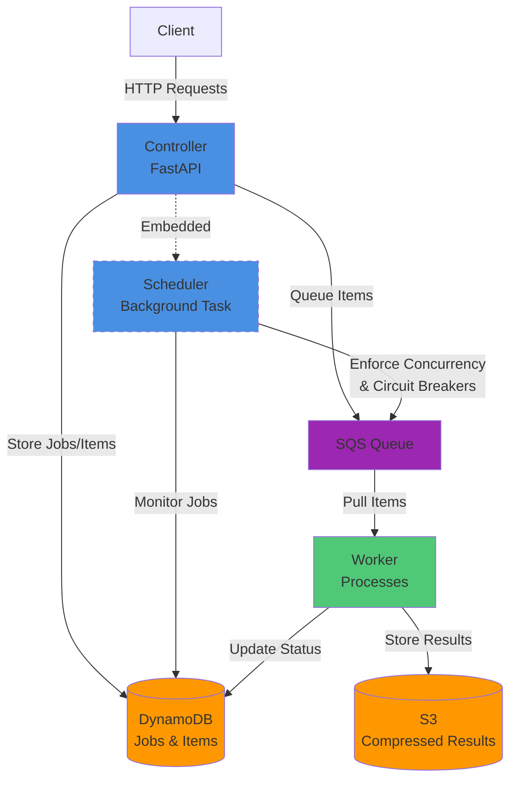

# Web Scraper Service

A distributed web scraping service built with FastAPI, AWS SQS, and DynamoDB. The service provides a robust framework for executing scrapers at scale with features like concurrency control, circuit breakers, retry logic, and proxy support.

## Overview

The web scraper service consists of three main components:

-   **Controller**: FastAPI service that manages jobs, queues items to SQS, and monitors execution
-   **Worker**: Processes scrape jobs from SQS, executes scrapers, and stores results in S3
-   **Scheduler**: Background task that manages job state, enforces concurrency limits, and implements circuit breakers

### Architecture



## Setup

### Prerequisites

-   Python 3.13+
-   [uv](https://github.com/astral-sh/uv) package manager
-   AWS account with configured credentials
-   Podman (for deployment)

### Installation

1. Clone the repository:

```bash
git clone git@github.com:bryanparker-ms/scraper-service.git
cd web-scraper
```

2. Install dependencies with `uv`:

```bash
uv sync
```

3. Set up environment variables:

Copy the example environment file and fill in your values:

```bash
cp .env.example .env
```

Then edit `.env` with your configuration:

```bash
# Required AWS Configuration
AWS_REGION=us-east-1
AWS_ACCESS_KEY_ID=your-access-key-id
AWS_SECRET_ACCESS_KEY=your-secret-access-key
AWS_ACCOUNT_ID=123456789012

# Required AWS Resources
WEB_SCRAPER_TABLE_NAME=web-scraper-jobs
WEB_SCRAPER_QUEUE_URL=https://sqs.us-east-1.amazonaws.com/123456789/web-scraper-queue
WEB_SCRAPER_RESULTS_BUCKET=web-scraper-results

# Optional: Worker Configuration
WEB_SCRAPER_DDB_LIMIT=100
WEB_SCRAPER_MAX_RETRIES=3
WEB_SCRAPER_QUEUE_MESSAGE_VISIBILITY_SECS=300

# Optional: API Authentication
API_KEY=your-secret-api-key

# Optional: BrightData Proxy Configuration
PROXY_URL=brd.superproxy.io:33335
PROXY_DATACENTER_USER=your-datacenter-username
PROXY_RESIDENTIAL_USER=your-residential-username
PROXY_WEB_UNLOCKER_USER=your-web-unlocker-username
PROXY_DATACENTER_PASSWORD=your-datacenter-password
PROXY_RESIDENTIAL_PASSWORD=your-residential-password
PROXY_WEB_UNLOCKER_PASSWORD=your-web-unlocker-password
```

4. Create required AWS resources:
    - DynamoDB table with `job_id` as partition key and `item_id` as sort key
    - SQS queue for job items
    - S3 bucket for storing results

## Running the Service

### Local Development

#### Option 1: Using `start.sh` script

```bash
# Start both controller and worker
./scripts/start.sh all

# Start only the controller
./scripts/start.sh controller

# Start only the worker
./scripts/start.sh worker
```

#### Option 2: Using `uv` directly

**Controller (FastAPI):**

```bash
uv run fastapi dev src/controller/main.py
```

**Worker:**

```bash
uv run -m src.worker.main
```

The controller will be available at `http://localhost:8000`.

### Testing Scrapers Locally

Use the test harness to run scrapers without infrastructure:

```bash
# List available scrapers
uv run python scripts/test_scraper.py --list

# Single input
uv run python scripts/test_scraper.py maricopa-az --input parcel_number=200-14-030

# Batch from JSONL file (sequential)
uv run python scripts/test_scraper.py maricopa-az --batch-file inputs.jsonl

# Batch with concurrency
uv run python scripts/test_scraper.py maricopa-az --batch-file inputs.jsonl --concurrency 5

# Output as JSON
uv run python scripts/test_scraper.py maricopa-az --input parcel_number=200-14-030 --json
```

**JSONL file format:**

```jsonl
{"item_id": "1", "parcel_number": "200-14-030"}
{"item_id": "2", "parcel_number": "200-14-031"}
{"item_id": "3", "parcel_number": "200-14-032"}
```

## API Routes

All routes require authentication via the `X-API-Key` header (unless `API_KEY` is not set for local development).

### List Jobs

Get the latest 100 jobs.

```bash
curl http://localhost:8000/jobs \
  -H "X-API-Key: your-api-key"
```

**Response:**

```json
{
    "jobs": [
        {
            "job_id": "job-123",
            "job_name": "My Scraping Job",
            "scraper_id": "maricopa-az",
            "status": "running",
            "created_at": "2025-01-15T10:30:00Z",
            "total_items": 100,
            "status_summary": {
                "pending": 20,
                "queued": 10,
                "in_progress": 5,
                "success": 60,
                "failed": 5
            }
        }
    ]
}
```

### Create Job

Submit a new scraping job.

```bash
curl -X POST http://localhost:8000/jobs \
  -H "Content-Type: application/json" \
  -H "X-API-Key: your-api-key" \
  -d '{
    "job_id": "my-job-123",
    "job_name": "Maricopa County Tax Records",
    "scraper_id": "maricopa-az",
    "items": [
      {"item_id": "1", "input": {"parcel_number": "200-14-030"}},
      {"item_id": "2", "input": {"parcel_number": "200-14-031"}}
    ]
  }'
```

**With execution policy:**

```bash
curl -X POST http://localhost:8000/jobs \
  -H "Content-Type: application/json" \
  -H "X-API-Key: your-api-key" \
  -d '{
    "job_id": "my-job-123",
    "job_name": "Maricopa County Tax Records",
    "scraper_id": "maricopa-az",
    "execution_policy": {
      "throttling": {
        "max_concurrent_workers": 3,
        "min_delay_between_items_seconds": 2
      },
      "circuit_breaker": {
        "min_requests": 10,
        "failure_threshold_percentage": 0.5
      },
      "retries": {
        "max_retries": 3,
        "backoff_strategy": "exponential",
        "backoff_factor": 1.0
      },
      "timeouts": {
        "connect_timeout_seconds": 10,
        "request_timeout_seconds": 30
      },
      "proxy": {
        "type": "residential",
        "geo_target": {
          "state": "AZ"
        }
      }
    },
    "items": [
      {"item_id": "1", "input": {"parcel_number": "200-14-030"}}
    ]
  }'
```

**Response:**

```json
{
    "job_id": "my-job-123",
    "status": "pending",
    "items_count": 2
}
```

#### Execution Policy Parameters

The execution policy allows fine-grained control over how your scraping job runs:

**Throttling:**
- `max_concurrent_workers`: Maximum number of items being processed simultaneously (includes both queued and in-progress items). Use this to avoid overwhelming target websites. Default: unlimited
- `min_delay_between_items_seconds`: Minimum delay between queueing items to SQS. Useful for rate-limiting job submission. Optional

**Circuit Breaker:**
- `min_requests`: Minimum number of items that must be processed before the circuit breaker can trip. This prevents premature failures on small jobs. Default: 10
- `failure_threshold_percentage`: Percentage of failures (0.0-1.0) that will trip the circuit breaker and fail the entire job. For example, 0.5 means the job fails if 50% of items fail. Default: 0.8

**Retries:**
- `max_retries`: Maximum number of retry attempts for failed items. Default: 3
- `backoff_strategy`: Strategy for calculating retry delays. Options: `exponential` (2^attempt * factor) or `linear` (attempt * factor). Default: exponential
- `backoff_factor`: Base multiplier for backoff delays in seconds. Default: 1.0

**Timeouts:**
- `connect_timeout_seconds`: Maximum time to wait for connection establishment. Default: 10
- `request_timeout_seconds`: Maximum time to wait for complete response. Default: 30

**Proxy:**
- `type`: Proxy type to use. Options: `datacenter`, `residential`, `web-unlocker`, `isp`. Requires BrightData credentials configured
- `geo_target`: Geographic targeting for residential proxies
  - `state`: US state code (e.g., "CA", "NY", "AZ") - only supported for residential proxies
  - `city`: City name (e.g., "los_angeles") - only supported for residential proxies

### Get Job Status

Get detailed status of a job.

```bash
curl http://localhost:8000/jobs/my-job-123/status \
  -H "X-API-Key: your-api-key"
```

**Response:**

```json
{
    "job_id": "my-job-123",
    "job_name": "Maricopa County Tax Records",
    "scraper_id": "maricopa-az",
    "status": "running",
    "created_at": "2025-01-15T10:30:00Z",
    "updated_at": "2025-01-15T10:35:00Z",
    "total_items": 100,
    "status_summary": {
        "pending": 20,
        "queued": 10,
        "in_progress": 5,
        "success": 60,
        "failed": 5
    }
}
```

### Get Job Results

Retrieve results manifest for a completed job.

```bash
# Get all results
curl http://localhost:8000/jobs/my-job-123/results \
  -H "X-API-Key: your-api-key"

# Filter by status
curl "http://localhost:8000/jobs/my-job-123/results?filter=success" \
  -H "X-API-Key: your-api-key"

# Get specific manifest part (for large jobs)
curl "http://localhost:8000/jobs/my-job-123/results?part=0" \
  -H "X-API-Key: your-api-key"
```

**Response:**

```json
{
    "job_id": "my-job-123",
    "metadata": {
        "total_items": 100,
        "success_count": 95,
        "failed_count": 5,
        "manifest_parts": 1
    },
    "items": [
        {
            "item_id": "1",
            "status": "success",
            "storage_keys": {
                "html": "jobs/my-job-123/items/1/result.html.gz",
                "data": "jobs/my-job-123/items/1/result.json.gz"
            }
        }
    ]
}
```

### Download Job Item Artifact

Download a specific artifact (HTML, data, metadata, screenshot) for a job item.

```bash
# Download HTML
curl "http://localhost:8000/jobs/my-job-123/items/1/download?artifact=html" \
  -H "X-API-Key: your-api-key" \
  -o result.html

# Download extracted data
curl "http://localhost:8000/jobs/my-job-123/items/1/download?artifact=data" \
  -H "X-API-Key: your-api-key" \
  -o result.json

# Download metadata
curl "http://localhost:8000/jobs/my-job-123/items/1/download?artifact=metadata" \
  -H "X-API-Key: your-api-key" \
  -o metadata.json
```

### Get Queue Length

Get the current number of items in the SQS queue.

```bash
curl http://localhost:8000/jobs/queue/length \
  -H "X-API-Key: your-api-key"
```

**Response:**

```
42
```

### Purge Queue

Clear all items from the SQS queue (useful for testing).

```bash
curl -X POST http://localhost:8000/jobs/queue/purge \
  -H "X-API-Key: your-api-key"
```

## Deployment

The service is designed to run on AWS with the following components:

-   **Controller**: AWS App Runner
-   **Worker**: ECS Fargate
-   **Infrastructure**: DynamoDB, SQS, S3, ECR

### Prerequisites

1. AWS CLI configured with appropriate credentials
2. Docker or Podman installed
3. Infrastructure deployed (DynamoDB table, SQS queue, S3 bucket, ECR repositories)

### Deploy Services

Use the deployment script to build and push container images:

```bash
# Deploy both controller and worker
./scripts/deploy.sh all

# Deploy only controller
./scripts/deploy.sh controller

# Deploy only worker
./scripts/deploy.sh worker
```

The script will:

1. Build Docker images for linux/amd64 platform
2. Tag and push images to ECR
3. Trigger App Runner deployment for controller
4. Update ECS service for worker with forced new deployment

### Manual Deployment Steps

If you prefer manual deployment:

1. **Build images:**

```bash
# Controller
podman build --platform linux/amd64 -f controller.dockerfile -t controller:latest .
podman tag controller:latest ${ACCOUNT_ID}.dkr.ecr.${AWS_REGION}.amazonaws.com/web-scraper-controller:latest

# Worker
podman build --platform linux/amd64 -f worker.dockerfile -t worker:latest .
podman tag worker:latest ${ACCOUNT_ID}.dkr.ecr.${AWS_REGION}.amazonaws.com/web-scraper-worker:latest
```

2. **Push to ECR:**

```bash
aws ecr get-login-password --region ${AWS_REGION} | podman login --username AWS --password-stdin ${ACCOUNT_ID}.dkr.ecr.${AWS_REGION}.amazonaws.com

podman push ${ACCOUNT_ID}.dkr.ecr.${AWS_REGION}.amazonaws.com/web-scraper-controller:latest
podman push ${ACCOUNT_ID}.dkr.ecr.${AWS_REGION}.amazonaws.com/web-scraper-worker:latest
```

3. **Update services:**

```bash
# Controller (App Runner)
aws apprunner start-deployment \
  --service-arn <service-arn> \
  --region ${AWS_REGION}

# Worker (ECS)
aws ecs update-service \
  --cluster web-scraper-cluster \
  --service web-scraper-worker \
  --force-new-deployment \
  --region ${AWS_REGION}
```

## Writing Custom Scrapers

Create a new scraper by extending `BaseHttpScraper`:

```python
from src.worker.scraper import BaseHttpScraper, ScraperError
from src.worker.registry import registry
from src.shared.models import JobItem
from src.worker.models import ScrapeResult

@registry.register(
    scraper_id='my-scraper',
    name='My Custom Scraper',
    version='1.0.0',
    description='Scrapes data from example.com'
)
class MyCustomScraper(BaseHttpScraper):
    def validate_inputs(self, job_item: JobItem) -> None:
        if 'record_id' not in job_item.input:
            raise ScraperError('Missing required input: record_id', 'invalid_input')

    async def do_scrape(self, client: httpx.AsyncClient, job_item: JobItem) -> ScrapeResult:
        record_id = job_item.input['record_id']

        # Make HTTP request
        resp = await client.get(f'https://example.com/records/{record_id}')
        resp.raise_for_status()

        html_content = resp.text

        # Validate response
        self.assert_html_contains(html_content, 'Record Details', 'Invalid record page')

        # Parse HTML
        soup = self.parse_html(html_content)

        # Extract data
        data = {
            'title': self.extract_text_by_selector(soup, 'h1.title', required=True),
            'value': self.extract_text_by_selector(soup, '.value'),
        }

        return ScrapeResult(html=html_content, data=data)
```

## Features

-   **Concurrency Control**: Limit simultaneous workers per job
-   **Circuit Breakers**: Automatically fail jobs with high error rates
-   **Retry Logic**: Configurable exponential/linear backoff
-   **Proxy Support**: BrightData datacenter/residential/ISP proxies with geo-targeting
-   **Result Storage**: Compressed HTML and JSON stored in S3
-   **Manifest Generation**: Chunked manifests for jobs with millions of items
-   **API Authentication**: Optional API key authentication

## License

[Add your license here]
